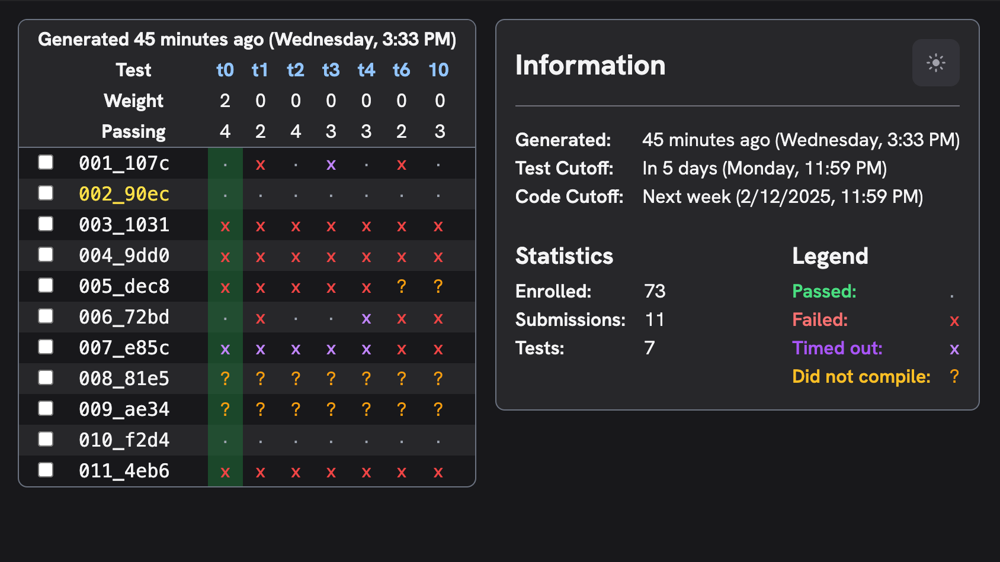

# Gheith Grid+

## Development

This project uses [Bun](https://bun.sh) and [Just](https://github.com/casey/just?tab=readme-ov-file#just).

Use `bun install` to install dependencies.

- Use `bun run dev` to start hot-reloading dev server, and open <http://localhost:3000/~someone/cs439t_f24_p3new> to view reference.

## Deployment

- Copy the `.env.example` file to `.env`, and fill out both environment variables.

- Then, use `just deploy` to build, and push to the SSH server you listed in `.env`. You can read over the `justfile` to validate/understand what is being deployed and to where.
